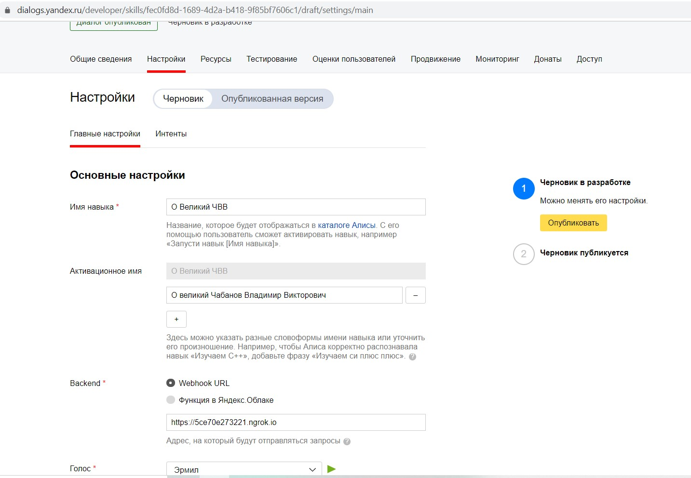
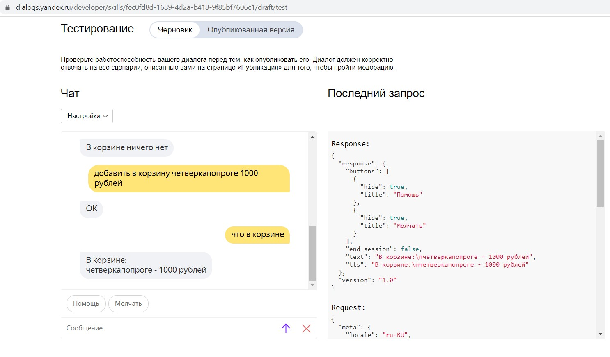
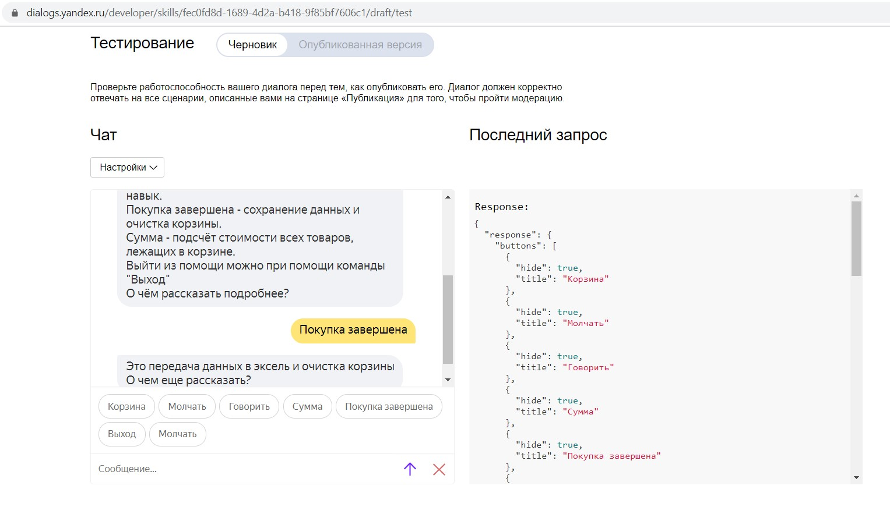
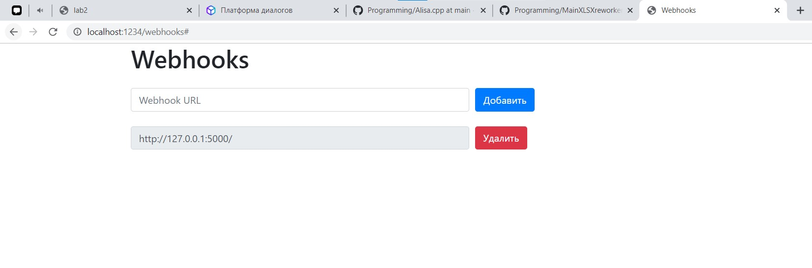

<p align="center">МИНИСТЕРСТВО НАУКИ  И ВЫСШЕГО ОБРАЗОВАНИЯ РОССИЙСКОЙ ФЕДЕРАЦИИ<br>
Федеральное государственное автономное образовательное учреждение высшего образования<br>
"КРЫМСКИЙ ФЕДЕРАЛЬНЫЙ УНИВЕРСИТЕТ им. В. И. ВЕРНАДСКОГО"<br>
ФИЗИКО-ТЕХНИЧЕСКИЙ ИНСТИТУТ<br>
Кафедра компьютерной инженерии и моделирования</p>
<br>
<h3 align="center">Отчёт по лабораторной работе № 2<br> по дисциплине "Программирование"</h3>

<br><br>

<p>студента 1 курса группы ПИ-б-о-201(2)<br>
Чахмарова Османа Рустемовича<br>
направления подготовки 09.03.04 "Программная инженерия"</p>


<br><br>
<table>
<tr><td>Научный руководитель<br> старший преподаватель кафедры<br> компьютерной инженерии и моделирования</td>
<td>(оценка)</td>
<td>Чабанов В.В.</td>
</tr>
</table>
<br><br>

<p align="center">Симферополь, 2020</p>
<hr>

## Постановка задачи

1. Разработайте и зарегистрируйте навык для Алисы на сервисе Яндекс.Диалоги

2. В качестве backend-a для навыка реализуйте приложение на языке С++ выполняющее следующие функции:

    I. Составление продуктовой корзины:

        - Добавление продукта в корзину;
        - Удаление продукта из корзины;
        - Очистка корзины;
        - Вывод списка товаров в корзине;
        - Подсчёт стоимости товаров в корзине.

    II. Вывод справочной информации по навыку;

    III. Регистрацию webhook-ов сторонних сервисов;

    IV. Отправку данных на сторонние сервисы. 

3. В качестве стороннего сервиса реализуйте приложение на языке Python выполняющее следующие функции:

    I. Ожидание данных о покупке;
    II. Сохранение поступивших данных в excel-документ.

Подробности указаны далее.

## Цель работы

- Получить представления о структуре post-запроса;
- Изучить webhooks как метод взаимодействия web-приложений;

## Выполнение работы

#### Подготовка к созданию программы

1. Изучаем информацию о post-запросах
2. Изучаем информацию о вебхуках

#### Создание серверного приложения

Создаём серверное приложение, которое генерируют сайт с вебхуками посредством post- и get-запросов. Сервер слушает запросы, приходящие на `localhost` порт `1234` и генерирует страницу со списком вебхуков, которые кешируются в json-файл. При получении post-запроса (он отправляется при нажатии на страницк на кнопку `Принять` или `Удалить`) сервер смотрит, какой запос пришёл и добавляет или удаляет вебхук.



*Рисунок 1. Настройки навыка*

<details>
<summary>Исходный код</summary>

```c++

```
</details>
<br>

#### Подготовка webhook для Алисы и регистрация навыка

1. Запускаем ngrok, в команде `http` указываем `localhost:1234`. Копируем ссылку из поля `Forwarding`. Не закрываем ngrok до завершения работы с лабораторной.
2. Регистрируем навых, указываем скопированную ссылку в подразделе Backend



*Рисунок 2. Корзина*

Далее создаём навык Алисы, помогающий составить список покупок. Навык работает следующим образом: сервер отвечает на POST-запросы Алисы. Навык позволяет добавлять товары в корзину, выводить их список и суммарную стоимость.



*Рисунок 3. Помощь*

Также имеется возможность вывода справочной информации о командах, доступных в навыке.



*Рисунок 4. Вебхук*

#### Создание клиентского приложения

Создаём клиентское приложение, которое будет запускаться и ждать post-запрос к корню `/`. При получении запроса данные складываются в переменную-буфер. Данные приходят в json формате. Отправляется ответ: "OK". Когда количество записей в буфере превосходит 2, данные сохраняются в excel-таблицу data.xlsx и буфер очищается. Если файл уже существует, данные отправляются в конец этого файла.

<details>
<summary>Исходный код</summary>

```python

```
</details>
<br>

[Ссылка на эксель файл](data.xlsx) со списком покупок.

## Вывод

- Было получено представление о структуре post-запроса
- Был webhooks как метод взаимодействия web-приложений