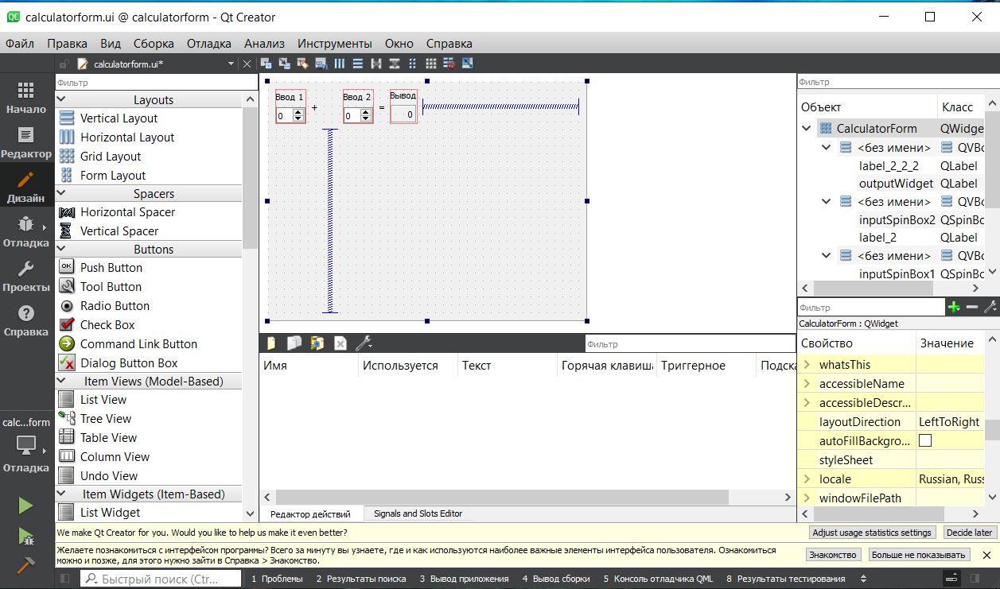

<p align="center">МИНИСТЕРСТВО НАУКИ И ВЫСШЕГО ОБРАЗОВАНИЯ РОССИЙСКОЙ ФЕДЕРАЦИИ<br>
Федеральное государственное автономное общеобразовательное учреждение высшего образования<br>
"КРЫМСКИЙ ФЕДЕРАЛЬНЫЙ УНИВЕРСИТЕТ им. В. И. ВЕРНАДСКОГО"<br>
ФИЗИКО-ТЕХНИЧЕСКИЙ ИНСТИТУТ<br>
Кафедра компьютерной инженерии и моделирования</p>
<br>
<h3 align="center">Отчёт по лабораторной работе № 4<br> по дисциплине "Программирование"</h3>

<br><br>

<p>студента 1 курса группы ПИ-б-о-201(2)<br>
Ратковского Георгия Витальевича<br>
направления подготовки 09.03.04 "Программная инженерия"</p>

<br><br>
<table>
<tr><td>Научный руководитель<br> старший преподаватель кафедры<br> компьютерной инженерии и моделирования</td>
<td>(оценка))</td>
<td>Чабанов В.В.</td>
</tr>
</table>
<br><br>

<p align="center">Симферополь, 2020</p>
<hr>

## Постановка задачи

Настроить рабочее окружение, для разработки программного обеспечения при помощи Qt и IDE Qt Creator, а также изучить базовые возможности данного фреймворка.

## Цель работы

- Установить фреймворк Qt
- Изучить основные возможности создания и отладки программ в IDE Qt Creator

## Выполнение работы

### Задание 1. Установка

1. Скачиваем и устанавливаем последнюю стабильную версию фреймворка Qt;
2. В процессе установки выбираем компоненты Qt для сборки при помощи MinGW и подходящую к этим компонентам версию MinGW.
3. Запускаем среду разработки Qt Creator и в разделе Примеры найдите проект Calculator Form Example.
4. Щёлкнув по проекту, изучаем краткую документацию по нему, выбраем настроиваем комплект сборки. Выбираем версию под Desktop, после чего щелкайте по кнопке Редактор.
5. На боковой панели в разделе Проекты в каталоге Формы открываем главную форму проекта и заменяем текст "Input 1", "Input 2", "Output" на "Ввод 1", "Ввод 2" и "Вывод" соответственно.
6. Скриншот приложения:
<br>
<em>Рисунок 1. Калькулятор из примера</em>

### Задание 2:

####Ответы на вопросы

1. Как изменить цветовую схему (оформление) среды? 
	Инструменты - Параметры - Среда - Тема
2. Как закомментировать/раскомментировать блок кода средствами Qt Creator?
	Выделить нужный блок и Ctrl + /

3. Как открыть в проводнике Windows папку с проектом средствами Qt Creator? 
	Сtrl + O и выбираешь папку.

4. Какое расширение файла-проекта используется Qt Creator? 
	.pro/.user

5. Как запустить код без отладки?
	Ctrl + R / Сборка - Запустить

6. Как запустить код в режиме отладки?
	F5

7. Как установить/убрать точку останова (breakpoint)?
	ЛКМ слева от номера строки или F9

### Задание 3. Первый проект

1. Создаём консольное приложение без QT

2. Заменяем содержимое файла main.cpp на:

```C++
#include <iostream>
 
int main() {
    int i;
    double d;
    i = 5;
    d = 5;
    std::cout << i << d;
}
```

3. Переключаемся в режим Отладка

4. Устанавливаем остановки на 6,7,8 строках

5. Выполняем программу:

В 6-й строке:
d = 1.9432123584258235e-316
i = 0

В 7-й строке:
d = 1.9432123584258235e-316
i = 5

В 8-й строке:
d = 5
i = 5

### Задание 4.

Начиная работать с новым инструментом важно не забыть настроить git, а точнее файл .gitignore, чтобы в репозиторий не попадал всякий мусор.

### Вывод

- Установили фреймворк Qt
- Изучили основные возможности создания и отладки программ в IDE QT Creator