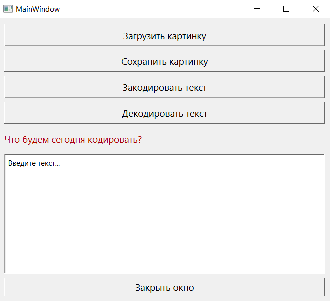

МИНИСТЕРСТВО НАУКИ  И ВЫСШЕГО ОБРАЗОВАНИЯ РОССИЙСКОЙ ФЕДЕРАЦИИ 
Федеральное государственное автономное образовательное учреждение высшего образования 
"КРЫМСКИЙ ФЕДЕРАЛЬНЫЙ УНИВЕРСИТЕТ им. В. И. ВЕРНАДСКОГО" 
ФИЗИКО-ТЕХНИЧЕСКИЙ ИНСТИТУТ 
Кафедра компьютерной инженерии и моделирования

 
<h3 align="center">Отчёт по лабораторной работе № 5  по дисциплине "Программирование"</h3>

  

студента 1 курса группы ПИ-б-о-201(2) 
Чахмарова Османа Рустемовича 
направления подготовки 09.03.04 "Программная инженерия"

  
<table>
<tr><td>Научный руководитель  старший преподаватель кафедры  компьютерной инженерии и моделирования</td>
<td>(оценка)</td>
<td>Чабанов В.В.</td>
</tr>
</table>
  

Симферополь, 2020

## Постановка задачи

Создать десктоп приложение с GUI позволяющее сохранять текстовую информацию в изображение формата png без видимого изменения исходного изображения. Приложение должно позволять сохранять текст в картинку и извлекать текст из картинки.

## Цель работы

- Изучить базовые встроенные элементы фреймворка Qt предназначенные для создания приложений с графическим интерфейсом пользователя (GUI)

- Изучить сигнально-слотовую систему, как один из способов организации взаимодействия компонентов GUI

- Получить практический навык работы с побитовыми операторами

## Выполнение работы

С помощью всеми известного QT Designer Был создан графический интерфейс приложения, способного зашифровывать текст в изображения. Далее были созданы 2 программы, которые успешно могли использовать этот дизайн и отлично функционировали.

 
<em>Рисунок 1. Интерфейс приложения</em>

### Ответ на вопрос про зашифрованное сообщение: Как зовут и что он обещал?

[Ответ тут](./media/Rick.html)

 
<em>Рисунок 2. Rick Astley</em>

### Каталоги

[[C++]](./C++)

[[Python]](./Python)

[Рисунок с зашифрованным текстом](./media/ChtoZheTam.png)

## Вывод

- Были изучены базовые встроенные элементы фреймворка Qt предназначенные для создания приложений с GUI

- Была изучена сигнально-слотовую систему, как один из способов организации взаимодействия компонентов GUI

- Был получен практический навык работы с побитовыми операторами